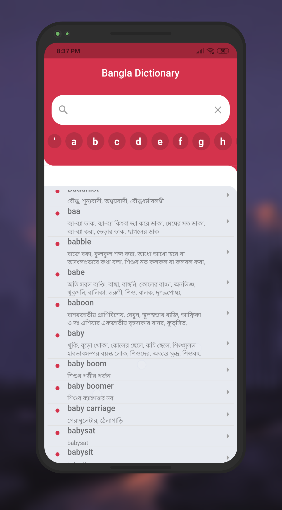

 link to:[main post](https://www.squadhead.com/blog/flutter-bangla-dictionary)

> I made this simple English to Bengali dictionary with flutter to test flutter's ability to process large files efficiently.Fot this I used a 14mb json file which I had to parse with flutter isolates that parsed this huge data concurrently in the background. So user have to wait little or no time at the biginning for app to load the data


Features and Plugins I've used: 
 - Flutter_Bloc
 - Json (as dictionary database)
 - Domain driven design
 - Freezed
 - Darz
 - Hive (to run query on dictionary)
 - Autotrie (For Searching words)


For concurrent process I had to call those fuctions out of the class: 

```dart
Future<List<Word>> getWords() async {
  final String minidb = await rootBundle.loadString('asset/db.json');
  final List<Word> words = await compute(parseWord, minidb);
  return words;
}

List<Word> parseWord(String jsonString) {
  final List<dynamic> json = jsonDecode(jsonString) as List<dynamic>;

  return List<Word>.from(
      json.map((e) => Word.fromJson(e as Map<String, dynamic>)));
}
```




 

### Note

This is an eperimental project to justify flutters capability, hence I do not advise to use this project in real life as I do not own this database, I cannot guarantee its rich vocabulary.


